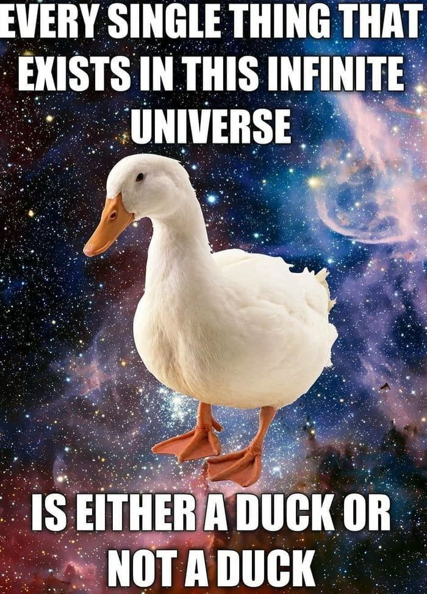

+++
title = "Die Entscheidbarkeit aller Entitäten"
date = "2025-05-17"

[taxonomies]
tags=["memes"]

[extra]
repo_view = true
comment = true
+++

_Disclaimer: Der Nachfolgende Text erhebt keinerlei Anspruch auf formale Korrektheit oder gar Sinnhaftigkeit._

_Zweiter Disclaimer: Dieser Text ist ein erster Entwurf._

# Einleitung
Man betrachte das nachfolgende Meme:

Auf den ersten Blick erscheint die Aussage offensichtlic wahr zu sein, schließlich gibt es ja nur zwei Möglichkeiten; Ente oder nicht Ente.
Als FOL[^1]-Formel könnte die Aussage wie folgt formalisiert werden:
$$
  \forall(x) . Ente(x) \lor \lnot Ente(x)
$$
Es handelt sich hierbei um eine Instanz des Satzes des ausgeschlossenen Dritten, nach welchem jede beliebige Aussage (wie hier etwa $Ente(x)$) entweder wahr oder falsch sein muss.
Tatsächlich aber waren sich aber auch schlaue Menschen nicht ganz einig ob das so überhaupt stimmt[^2].
Ob nun wirklich jedes Objekt im Univerum eine Ente ist oder nicht, ist vielleicht gar nicht so eindeutig mit "Ja" zu beantworten.

# Eine Frage der Interpretation
Selbst wenn das Dritte nun nicht ausgeschlossen werden kann, könnte man meinen dass eine Ente ja recht wohldefiniert sein sollte.
Sofern uns eine Definition der Ente bekannt ist welche für jedes beliebige Objekt $x$ die Entenfrage entscheidet, dann können wir dem humoristischen Aspekt des dargestellten Memes endlich auch ohne erkenntnistheoretische Gewissensbisse fröhnen.

Wikipedia[^3] macht es natürlich wieder kompliziert und bietet gleich mehrere Interpretationen einer "Ente" an (darunter u.a. verschiedene "Entenvögel", Fahr- und Flugzeuge und einen Fußballspieler namens "Willi Lippens"). Bei dem im Meme abgebildeten Entenvogel handelt es sich, meiner absolut unqualifizierten Klassifizierung nach, wohl um eine "Hausente"[^4] welche wiederum eine Art Spezialisierung einer "Stockente" darstellt.

An diesem Punkt nimmt das Unheil aber bereits seinen Lauf. Betrachten wir die Mengen $Hausente \subseteq M$ und $Stockente \subseteq M$, so besteht eine Teilmengenrelation $Hausente \subsetneq Stockente$. Ein nicht domestizierte Ente $x$ läge in der Mengendifferenz $Stockende \setminus Hausente$.
Die Person welche das Meme erstellt hat, hat es schändlicherweise vernachlässigt eine genaue Spezifikation einer Ente beizufügen.
Es besteht also ein gewisser Interpretationsspielraum und wir könnten "Ente" sowohl auf $Stockente$ als auch auf $Hausente$ beziehen (oder auf irgendwelche Fußballspieler, aber darauf verzichte ich hier).

Wagen wir ein Gedankenexperiment: Alice und Brittany haben einen gemeinsamen Sohn Charlie. Alice geht von der Mengengleichheit $Ente = Hausente$ aus, während Brittany der Überzeugung ist $Ente = Stockente$. 
Sohn Charlie lernt neues indem er Klassifizierung seiner Eltern übernimmt und auf die von ihm wahrgenommene Welt anwendet. Wir versuchen nun, uns in Charlie hineinzuversetzen. 
Eines Tages besucht die Familie einen See in welchem (nicht domestizierte) Enten schwimmen. Charlie sieht hier zum ersten Mal in seinem Leben eine Ente.
Da Charlie eine extrem gute Intuition hat, fragt er "Ist das eine Ente?".
Logischerweise antwortet Alice mit "Nein", während Brittany gleichzeitig mit "Ja" antwortet.
Im nächsten Moment werden sowohl Alice als auch Brittany zufällig von einem Blitz getroffen und sind auf der Stelle tot.

Von nun an lebt Charlie in einer schrecklichen Welt. Sei $x \in M$ die (nicht domestizierte) Ente welche Charlie auf dem See gesehen hat.
Für Charlies Interpretation einer $Ente$ gilt nun
$$
\begin{align}
  Ente(x) \land \lnot Ente(x)
\end{align}
$$
Daraus leitet er sich folgerichtig ab
$$
  Ente(x) \land \lnot Ente(x) \vdash Ente(x), Ente(x) \land \lnot Ente(x) \vdash \lnot Ente(x)
$$
$$
  Ente(x) \vdash Ente(x) \lor Gottheit(x)
$$
$$
  Ente(x) \lor Gottheit(x), \lnot Ente(x) \vdash Gottheit(x)
$$
In natürlicher Sprache könnte diese Herleitung etwa so funktionieren
1. Das Tier das Charlie gesehen hat _ist eine Ente_ (denn das hat Brittany gesagt). Das Tier das Charlie gesehen hat ist auch _nicht eine Ente_ (denn das hat Alice gesagt). Die Aussagen _Das Tier ist eine Ente_ und _Das Tier ist nicht eine Ente_ sind also wahr.
2. Wenn das Tier eine Ente ist, dann ist folgendes korrekt: _Das Tier ist eine Ente ODER das Tier ist eine Gottheit_.
3. Aus 1. wissen wir _das Tier ist keine Ente_ und aus 2. wissen wir _das Tier ist eine Ente ODER das Tier ist eine Gottheit_. Aus den beiden Aussagen folgt: _Das Tier ist eine Gottheit_.

Charlie gründet in der Fogle eine fundamentalistische Sekte. Alle Menschen die seinen Glauben an die schwimmende Gottheit nicht teilen, sind Ungläubige und müssen von der Sekte bestraft (im Sinne von getötet) werden. Charlie geht als blutrünstiger Fanatiker in die Geschichte ein.

Genau deshalb sind präzise Spezifikationen wichtig.[^5]

# Fußnoten
[^1]: [First-order logic - Wikipedia](https://en.wikipedia.org/wiki/First-order_logic)
[^2]: [Brouwer-Hilbert controversy - Wikipedia](https://en.wikipedia.org/wiki/Brouwer%E2%80%93Hilbert_controversy)
[^3]: [Ente - Wikipedia](https://de.wikipedia.org/wiki/Ente)
[^4]: [Hausente - Wikipedia](https://de.wikipedia.org/wiki/Hausente)
[^5]: Genau genommen gibt es wahrscheinlich noch weitere, weniger drastische Beispiele für die Wichtigkeit von präzisen Spezifikationen in passenden Kontexten.

